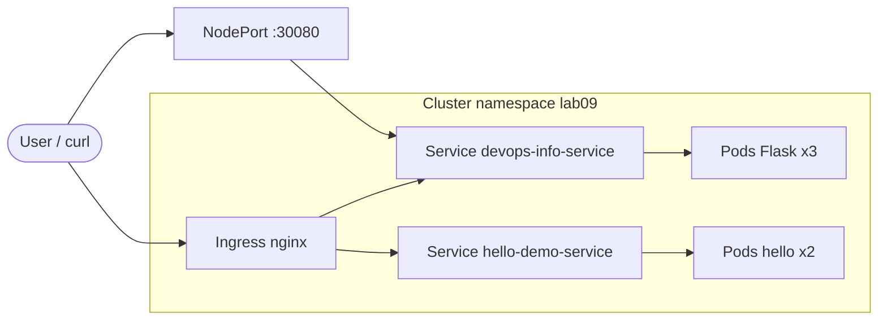

# Lab 09 — Kubernetes (namespace `lab09`)

Declarative manifests for the **DevOps Info Service** (Lab 2 image) plus optional **bonus**: second app and **Ingress with TLS**.

## 1. Architecture overview

Traffic can reach the main app in two ways:

- **NodePort** — `devops-info-service` exposes port **80** in the cluster and **30080** on the node (maps to container **5000**).
- **Ingress (bonus)** — NGINX Ingress terminates **HTTPS** for `local.example.com` and routes **`/app1`** → Flask app, **`/app2`** → `nginxdemos/hello`.



**Resource strategy:** Flask pods request **128Mi / 100m CPU**, limit **256Mi / 200m** — enough for a small Flask app and keeps the scheduler informed. The demo hello app uses lower requests (**64Mi / 50m**).

---

## 2. Manifest files

| File | Purpose |
|------|---------|
| `namespace.yml` | Isolates all Lab 09 objects in `lab09`. |
| `deployment.yml` | **3 replicas (Task 2), scaled to 5 (Task 4)**, RollingUpdate (**maxSurge: 1**, **maxUnavailable: 0**), probes, resources, non-root pod security context, image `pakmengamer/devops-info-service:1.0.1`. |
| `service.yml` | **NodePort** for the Flask Deployment; selector `app: devops-info-service`. |
| `deployment-app2.yml` | Second workload: **`nginxdemos/hello`** (2 replicas) for Ingress bonus. |
| `service-app2.yml` | **ClusterIP** for the hello app (only reached via Ingress or `port-forward`). |
| `ingress.yml` | Path-based rules + **TLS** secret `tls-secret`; regex rewrite so backends receive `/`. |

**Why 3 replicas?** Lab minimum; improves availability during node or pod failures.

**Why separate liveness vs readiness?** Liveness hits **`/health`** (process up). Readiness hits **`/ready`** so traffic is only sent when the app should serve requests (same app today; you can later extend `/ready` with dependency checks).

---

## 3. Deployment evidence

Run against your cluster after applying manifests (see section 4). Below are the **real** outputs from my local `kind` cluster (initial deploy, before scaling to 5).

```bash
kubectl get all -n lab09 -o wide
kubectl get pods,svc -n lab09 -o wide
kubectl describe deployment/devops-info-deployment -n lab09
```

```text
NAME                                          READY   STATUS    RESTARTS   AGE   IP            NODE                  NOMINATED NODE   READINESS GATES
pod/devops-info-deployment-6488694f95-d6nt4   1/1     Running   0          72s   10.244.0.10   lab09-control-plane   <none>           <none>
pod/devops-info-deployment-6488694f95-fdv4z   1/1     Running   0          86s   10.244.0.8    lab09-control-plane   <none>           <none>
pod/devops-info-deployment-6488694f95-nsfmt   1/1     Running   0          79s   10.244.0.9    lab09-control-plane   <none>           <none>

NAME                          TYPE       CLUSTER-IP    EXTERNAL-IP   PORT(S)        AGE     SELECTOR
service/devops-info-service   NodePort   10.96.27.10   <none>        80:30080/TCP   3m38s   app=devops-info-service

NAME                                     READY   UP-TO-DATE   AVAILABLE   AGE     CONTAINERS            IMAGES                                  SELECTOR
deployment.apps/devops-info-deployment   3/3     3            3           3m38s   devops-info-service   pakmengamer/devops-info-service:1.0.1   app=devops-info-service

NAME                                     DESIRED   CURRENT   READY   AGE     CONTAINERS            IMAGES                                  SELECTOR
replicaset.apps/devops-info-deployment-6488694f95   3         3         3       86s     devops-info-service   pakmengamer/devops-info-service:1.0.1   app=devops-info-service,pod-template-hash=6488694f95
replicaset.apps/devops-info-deployment-79786bbf6f   0         0         0       3m38s   devops-info-service   pakmengamer/devops-info-service:1.0.1   app=devops-info-service,pod-template-hash=79786bbf6f
```

```text
Name:                   devops-info-deployment
Namespace:              lab09
Replicas:               3 desired | 3 updated | 3 total | 3 available | 0 unavailable
StrategyType:           RollingUpdate
RollingUpdateStrategy:  0 max unavailable, 1 max surge
Container image:        pakmengamer/devops-info-service:1.0.1
Liveness probe:         http-get http://:http/health delay=15s timeout=3s period=10s
Readiness probe:        http-get http://:http/ready delay=5s timeout=2s period=5s
```

**App responds (port-forward):**

```bash
# terminal 1
kubectl port-forward -n lab09 svc/devops-info-service 8080:80
```

```text
curl -s http://127.0.0.1:8080/health
{"status":"healthy","timestamp":"2026-03-25T21:29:36.213300+00:00","uptime_seconds":86}

curl -s http://127.0.0.1:8080/ready
{"status":"ready","timestamp":"2026-03-25T21:29:36.591021+00:00"}
```

---

## 4. Operations performed

### 4.1 Install tools and start a cluster

See **"Step-by-step on your machine"** at the end of this file for condensed steps.

### 4.2 Build and publish the app image (before first deploy)

The Deployment expects **`pakmengamer/devops-info-service:1.0.1`** (matches `SERVICE_VERSION` in `app_python/app.py`). Push via GitHub Actions (push to `master` with `app_python/**` changes) **or** build locally and push to Docker Hub.

### 4.3 Apply manifests

```bash
kubectl apply -f k8s/namespace.yml
kubectl apply -f k8s/deployment.yml
kubectl apply -f k8s/service.yml
kubectl rollout status deployment/devops-info-deployment -n lab09
```

### 4.4 Scaling to 5 replicas

**Declarative (preferred):** set `spec.replicas: 5` in `deployment.yml`, then:

```bash
kubectl apply -f k8s/deployment.yml
kubectl get pods -n lab09 -w
```

**Imperative (quick check):**

```bash
kubectl scale deployment/devops-info-deployment -n lab09 --replicas=5
```

```text
deployment.apps/devops-info-deployment scaled
Waiting for deployment "devops-info-deployment" rollout to finish: 3 of 5 updated replicas are available...
Waiting for deployment "devops-info-deployment" rollout to finish: 4 of 5 updated replicas are available...
deployment "devops-info-deployment" successfully rolled out

NAME                                      READY   STATUS    RESTARTS   AGE     IP            NODE
devops-info-deployment-6488694f95-cj4x9   1/1     Running   0          13s     10.244.0.12   lab09-control-plane
devops-info-deployment-6488694f95-d6nt4   1/1     Running   0          2m17s   10.244.0.10   lab09-control-plane
devops-info-deployment-6488694f95-fdv4z   1/1     Running   0          2m31s   10.244.0.8    lab09-control-plane
devops-info-deployment-6488694f95-nsfmt   1/1     Running   0          2m24s   10.244.0.9    lab09-control-plane
devops-info-deployment-6488694f95-xftb9   1/1     Running   0          13s     10.244.0.11   lab09-control-plane
```

Then I run the rolling update on the same 5 replicas.

### 4.5 Rolling update and rollback

1. Change the Deployment (e.g. image tag to a new version, or add a harmless env var), then `kubectl apply -f k8s/deployment.yml`.
2. Watch: `kubectl rollout status deployment/devops-info-deployment -n lab09`
3. History: `kubectl rollout history deployment/devops-info-deployment -n lab09`
4. Roll back: `kubectl rollout undo deployment/devops-info-deployment -n lab09`

With **maxUnavailable: 0** and **maxSurge: 1**, Kubernetes creates new pods before terminating old ones, which avoids dropping below desired capacity during the rollout.

```text
After the rolling update (annotation in `template.metadata`), the rollout completed successfully:
deployment "devops-info-deployment" successfully rolled out

Rollout history:
deployment.apps/devops-info-deployment 
REVISION CHANGE-CAUSE
1         <none>
2         <none>
3         <none>

After rollback:
deployment "devops-info-deployment" rolled back
deployment "devops-info-deployment" successfully rolled out
```

**App checks (port-forward to `localhost:8080`):**

```text
Before rolling update (health):
{"status":"healthy","timestamp":"2026-03-25T21:31:07.888635+00:00","uptime_seconds":178}
ready:
{"status":"ready","timestamp":"2026-03-25T21:31:07.900163+00:00"}

After rollback (health):
{"status":"healthy","timestamp":"2026-03-25T21:33:19.920510+00:00","uptime_seconds":56}
ready:
{"status":"ready","timestamp":"2026-03-25T21:33:23.666702+00:00"}
```

### 4.6 Bonus — Ingress controller, second app, TLS

**Minikube**

```bash
minikube addons enable ingress
kubectl apply -f k8s/deployment-app2.yml
kubectl apply -f k8s/service-app2.yml
```

**kind** (install NGINX Ingress; see [ingress-nginx kind](https://kubernetes.github.io/ingress-nginx/deploy/#kind)) then apply the same two files.

**TLS secret** (run from repo root; keys are gitignored):

```bash
openssl req -x509 -nodes -days 365 -newkey rsa:2048 \
  -keyout k8s/tls.key -out k8s/tls.crt \
  -subj "/CN=local.example.com/O=local.example.com"

kubectl create secret tls tls-secret \
  --namespace=lab09 \
  --key=k8s/tls.key \
  --cert=k8s/tls.crt
```

**Ingress**

```bash
kubectl apply -f k8s/ingress.yml
```

**Hosts file:** add `local.example.com` pointing to the Ingress IP (minikube: `minikube ip`; kind: localhost with published ports per install doc).

```bash
curl -sk https://local.example.com/app1/health
curl -sk https://local.example.com/app2/
```

**Why Ingress over NodePort alone:** single entrypoint (often 80/443), name-based and path-based routing, TLS termination, and no fixed high node ports per service — better match for production-style HTTP services.

---

## 5. Production considerations

- **Probes:** Liveness avoids stuck processes; readiness keeps failing pods out of Service endpoints. Startup probes would be added if the app had a long initialization phase.
- **Resources:** Requests/limits protect the cluster and make scheduling predictable; tune using real metrics (CPU/memory), not guesses.
- **Improvements:** Use **Deployments + PDBs**, **HPA**, **Pod Security Standards**, **NetworkPolicies**, **external secrets**, **structured logging**, **ServiceMonitor** for Prometheus, and **distroless** or **minimal** base images with read-only root where possible.
- **Observability:** Keep **`/metrics`** on the Flask app; scrape with Prometheus in-cluster; aggregate logs with Loki/ELK; trace with OpenTelemetry if you add complexity.

---

## 6. Challenges and solutions

| Issue | What to check |
|-------|----------------|
| **ImagePullBackOff** | Image name/tag exists on Docker Hub; `docker pull` works; for minikube local builds: `eval $(minikube docker-env)` then build with the same tag. |
| **CrashLoopBackOff** | `kubectl logs -n lab09 deploy/devops-info-deployment`; `kubectl describe pod -n lab09 <pod>`. |
| **Probe failures** | Paths and ports: container listens on **5000**; Service uses **targetPort** `http` (name). |
| **Ingress 404** | Ingress class name (`nginx`); addon/controller running; host header and TLS secret present. |

**What we learned:** Kubernetes reconciles desired state in YAML with actual state; labels/selectors tie Services to Pods; rolling updates and rollbacks are first-class workflow features.

---

## Step-by-step on your machine

1. **Install** `kubectl` and **minikube** or **kind** ([official guide](https://kubernetes.io/docs/tasks/tools/)).
2. **Start a cluster** (`minikube start` or `kind create cluster`).
3. **Build and push the image** with the `/ready` endpoint and version **1.0.1** (via CI on `master` or manually with `docker build` + `docker push` to Docker Hub as `pakmengamer/devops-info-service:1.0.1`). If your Docker Hub username is different, update `image:` in `k8s/deployment.yml`.
4. **Apply manifests:** `kubectl apply -f k8s/namespace.yml -f k8s/deployment.yml -f k8s/service.yml`.
5. **Verify:** `kubectl get pods -n lab09`, then access via NodePort or `port-forward` (commands above).
6. **Scale and rollout:** run commands from §4.4-4.5 and **paste real outputs** into this README copy or your lab report.
7. **Bonus:** enable Ingress, apply `deployment-app2.yml` and `service-app2.yml`, create the TLS secret, apply `ingress.yml`, and verify HTTPS with `curl`.

If any step fails, share output from `kubectl describe pod` / `kubectl logs` for the specific pod.
