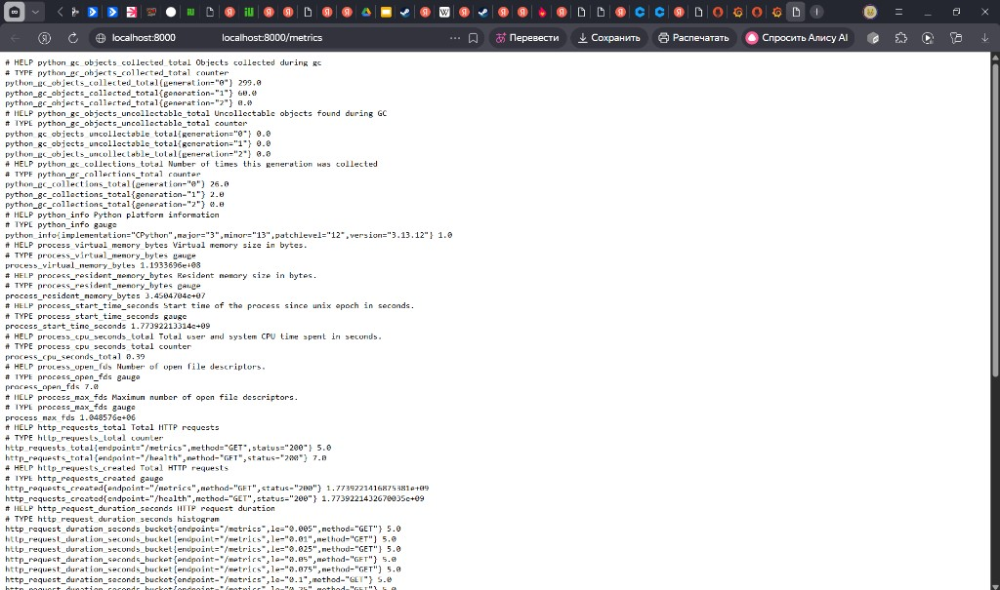
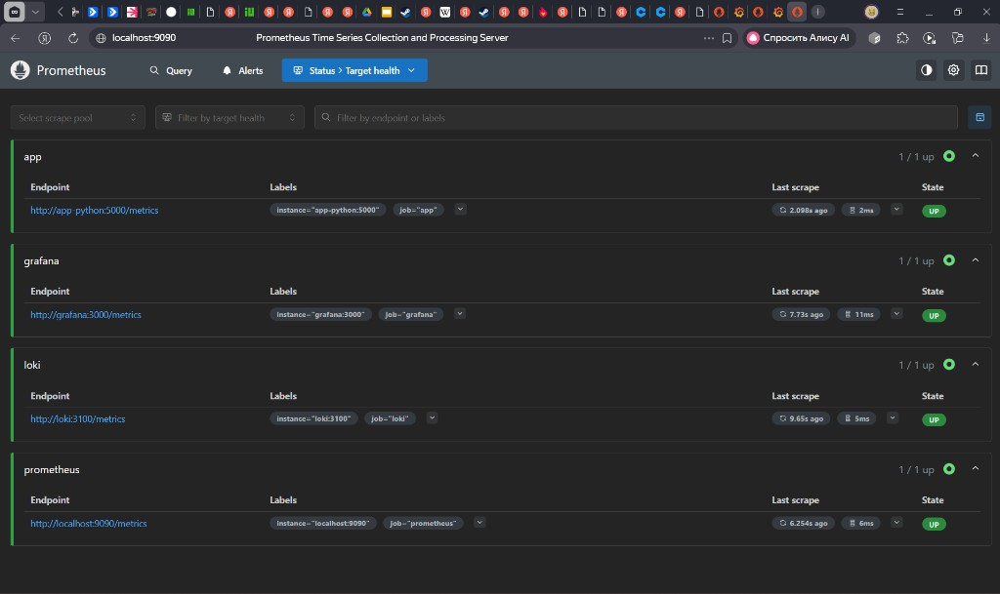
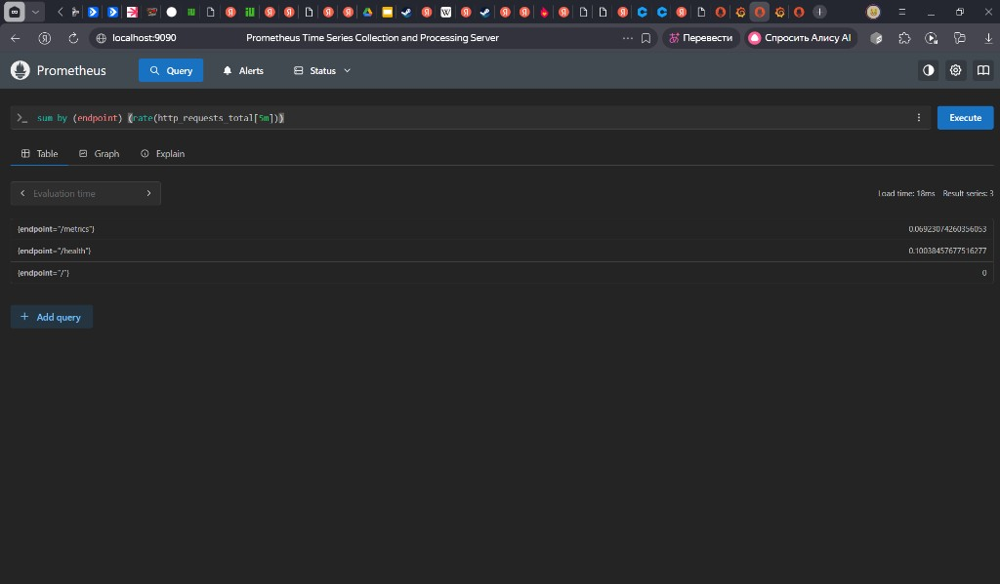
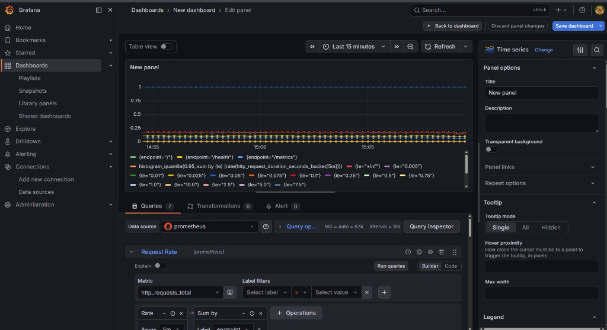

## LAB 08 — Metrics & Monitoring with Prometheus

In this lab I instrumented the existing Python **DevOps Info Service** with Prometheus metrics and deployed a small monitoring stack based on **Prometheus + Loki + Grafana** running in Docker Compose.  
The goal was to get full observability of the demo application using metrics (this lab) together with logs from LAB07.

---

### 1. Architecture

All monitoring components run on one host and are orchestrated with `docker compose` in the `monitoring` project.

- The Flask service `app-python` exposes Prometheus metrics on `GET /metrics`.
- **Prometheus** periodically scrapes metrics from:
  - the Python app,
  - Loki,
  - Grafana,
  - and from itself.
- **Grafana** connects to Prometheus as a data source and visualises the metrics on custom dashboards.
- **Promtail** tails Docker container logs and ships them into **Loki**; Grafana can use Loki as a second data source for log queries (from LAB07).

Logical data flow:

- User → `app-python` (`/`, `/health`, `/metrics`)
- `app-python` → exposes `/metrics` → scraped by Prometheus
- Prometheus → queried by Grafana (Prometheus data source)
- Promtail → Loki → queried by Grafana (Loki data source)

Screenshots:

- `localhost:8000/metrics` output with all application metrics:
  - `monitoring/docs/screenshots/01-metrics-endpoint.png`
- Prometheus `/targets` page with all jobs in `UP` state:
  - `monitoring/docs/screenshots/02-prometheus-targets-up.png`
- Prometheus query results for request rate by endpoint:
  - `monitoring/docs/screenshots/03-promql-request-rate.png`
- `docker compose ps` showing all services `Up ... (healthy)`:
  - `monitoring/docs/screenshots/04-docker-compose-healthy.png`
- Grafana dashboard with multiple panels based on Prometheus metrics:
  - `monitoring/docs/screenshots/05-grafana-dashboard.png`

Embedded evidence:










---

### 2. Application Instrumentation

File: `app_python/app.py`

The application is a small Flask service that exposes three HTTP endpoints:

- `/` – returns system and service information.
- `/health` – simple health check endpoint.
- `/metrics` – raw Prometheus metrics.

#### 2.1 HTTP RED metrics

To follow the **RED method** (Rate, Errors, Duration) I added the following metrics using `prometheus_client`:

- **Counter** `http_requests_total{method, endpoint, status}`  
  Total number of HTTP requests by method, normalised endpoint and HTTP status code.

- **Histogram** `http_request_duration_seconds{method, endpoint}`  
  Distribution of request duration in seconds, labelled by method and endpoint.

- **Gauge** `http_requests_in_progress`  
  Number of HTTP requests currently being processed.

Instrumentation is implemented via Flask middleware hooks:

- `@app.before_request`  
  - stores the request start time in `request.start_time`;  
  - increments `http_requests_in_progress`.

- `@app.after_request`  
  - calculates duration as `time.time() - request.start_time`;  
  - increments `http_requests_total` with labels `method`, `endpoint`, `status`;  
  - records duration in `http_request_duration_seconds`;  
  - decrements `http_requests_in_progress`.

#### 2.2 Business metrics

In addition to generic HTTP RED metrics, I added application‑specific metrics:

- **Counter** `devops_info_endpoint_calls{endpoint}`  
  Counts how many times each logical endpoint is called (for now only `/` is tracked).

- **Histogram** `devops_info_system_collection_seconds`  
  Measures how long it takes to collect system information in `get_system_info()`.

Usage:

- `get_system_info()` is wrapped in:

  ```python
  with system_info_collection_seconds.time():
      ...
  ```

  so every call contributes to the histogram.

- In the `/` handler (`index()`), the counter is incremented:

  ```python
  endpoint_calls.labels(endpoint="/").inc()
  ```

This provides:

- **R (Rate)** – via `http_requests_total` and `devops_info_endpoint_calls`.
- **E (Errors)** – via `http_requests_total` filtered by `status` (e.g. 5xx).
- **D (Duration)** – via `http_request_duration_seconds` and `devops_info_system_collection_seconds`.

---

### 3. Prometheus Configuration

File: `monitoring/prometheus/prometheus.yml`

Global configuration:

- `scrape_interval: 15s`
- `evaluation_interval: 15s`

Scrape jobs:

- Job **`prometheus`**  
  Scrapes Prometheus itself:

  ```yaml
  - job_name: 'prometheus'
    static_configs:
      - targets: ['localhost:9090']
  ```

- Job **`app`**  
  Scrapes the Flask application on `/metrics`:

  ```yaml
  - job_name: 'app'
    metrics_path: /metrics
    static_configs:
      - targets: ['app-python:5000']
  ```

- Job **`loki`**  

  ```yaml
  - job_name: 'loki'
    static_configs:
      - targets: ['loki:3100']
  ```

- Job **`grafana`**  

  ```yaml
  - job_name: 'grafana'
    static_configs:
      - targets: ['grafana:3000']
  ```

Prometheus container configuration (in `monitoring/docker-compose.yml`) enables data retention:

- `--storage.tsdb.retention.time=15d`
- `--storage.tsdb.retention.size=10GB`

---

### 4. Dashboard Walkthrough

In Grafana I created a custom dashboard named for example `DevOps Info Service — Metrics`.  
All panels use the Prometheus data source `http://prometheus:9090`.

The dashboard contains at least the following panels:

1. **Request Rate (requests per second by endpoint)**  
   - Type: **Time series**  
   - Query:
     ```promql
     sum by (endpoint) (rate(http_requests_total[5m]))
     ```  
   - Visualises traffic load for `/`, `/health`, `/metrics`.

2. **Error Rate (5xx errors)**  
   - Type: **Time series**  
   - Query:
     ```promql
     sum(rate(http_requests_total{status=~"5.."}[5m]))
     ```
   - Shows the server‑side error rate.

3. **Request Duration p95 (95th percentile latency)**  
   - Type: **Time series**  
   - Query:
     ```promql
     histogram_quantile(0.95,
       sum by (le) (rate(http_request_duration_seconds_bucket[5m]))
     )
     ```  
   - Unit: seconds.  
   - Shows high‑percentile latency of HTTP requests.

4. **Request Duration Heatmap**  
   - Type: **Heatmap**  
   - Query:
     ```promql
     sum by (le) (rate(http_request_duration_seconds_bucket[5m]))
     ```  
   - Visualises full latency distribution across histogram buckets.

5. **Active Requests**  
   - Type: **Gauge** or **Time series**  
   - Query:
     ```promql
     http_requests_in_progress
     ```  
   - Shows how many requests are being processed at the same time.

6. **Status Code Distribution**  
   - Type: **Pie chart**  
   - Query:
     ```promql
     sum by (status) (rate(http_requests_total[5m]))
     ```  
   - Shows the share of 2xx/4xx/5xx responses.

7. **Application Uptime**  
   - Type: **Stat**  
   - Query:
     ```promql
     up{job="app"}
     ```  
   - Displays `1` when the app target is up and `0` otherwise.

Additional panels can use business metrics:

- `rate(devops_info_endpoint_calls[5m])`
- `rate(devops_info_system_collection_seconds_sum[5m]) / rate(devops_info_system_collection_seconds_count[5m])`

The final dashboard (see screenshot `05-grafana-dashboard.png`) clearly demonstrates traffic, errors, latency and internal timings.

---

### 5. PromQL Examples

Useful PromQL queries used during the lab:

1. **Overall request rate across all endpoints**

   ```promql
   sum(rate(http_requests_total[5m]))
   ```

2. **Request rate per endpoint**

   ```promql
   sum by (endpoint) (rate(http_requests_total[5m]))
   ```

3. **5xx error rate**

   ```promql
   sum(rate(http_requests_total{status=~"5.."}[5m]))
   ```

4. **Global p95 latency**

   ```promql
   histogram_quantile(0.95,
     sum by (le) (rate(http_request_duration_seconds_bucket[5m]))
   )
   ```

5. **Per‑endpoint p95 latency**

   ```promql
   histogram_quantile(0.95,
     sum by (endpoint, le) (rate(http_request_duration_seconds_bucket[5m]))
   )
   ```

6. **Average system information collection time (business metric)**

   ```promql
   rate(devops_info_system_collection_seconds_sum[5m])
   /
   rate(devops_info_system_collection_seconds_count[5m])
   ```

7. **Endpoint call rate (business metric)**

   ```promql
   rate(devops_info_endpoint_calls[5m])
   ```

---

### 6. Production Configuration

File: `monitoring/docker-compose.yml`

#### 6.1 Health checks

Health checks ensure that Docker and orchestration tools can automatically detect failed containers:

- **Application (`app-python`)**

  ```yaml
  healthcheck:
    test: ["CMD-SHELL", "python -c \"import urllib.request,sys; urllib.request.urlopen('http://localhost:5000/health')\" || exit 1"]
    interval: 10s
    timeout: 5s
    retries: 5
  ```

- **Prometheus**

  ```yaml
  healthcheck:
    test: ["CMD-SHELL", "wget --no-verbose --tries=1 --spider http://localhost:9090/-/healthy || exit 1"]
    interval: 10s
    timeout: 5s
    retries: 5
  ```

- **Loki**

  ```yaml
  healthcheck:
    test: ["CMD-SHELL", "wget --no-verbose --tries=1 --spider http://localhost:3100/ready || exit 1"]
    interval: 10s
    timeout: 5s
    retries: 5
  ```

- **Grafana**

  ```yaml
  healthcheck:
    test: ["CMD-SHELL", "wget --no-verbose --tries=1 --spider http://localhost:3000/api/health || exit 1"]
    interval: 10s
    timeout: 5s
    retries: 5
  ```

#### 6.2 Resource limits

To avoid a noisy neighbour effect and keep the monitoring stack lightweight, I added Docker resource limits:

- `app-python`: `memory: 256M`, `cpus: "0.5"`
- `loki`: `memory: 1G`, `cpus: "1.0"`
- `grafana`: `memory: 512M`, `cpus: "0.5"`
- `promtail`: `memory: 256M`, `cpus: "0.5"`
- `prometheus`: `memory: 1G`, `cpus: "1.0"`

#### 6.3 Prometheus retention

In the Prometheus service configuration:

```yaml
command:
  - '--config.file=/etc/prometheus/prometheus.yml'
  - '--storage.tsdb.retention.time=15d'
  - '--storage.tsdb.retention.size=10GB'
```

Retention configuration is important because:

- It limits disk usage of the Prometheus TSDB.
- It keeps queries fast by removing very old data.
- It makes behaviour predictable for grading and demos.

#### 6.4 Persistent volumes

Named volumes are used to preserve data between container restarts:

- `grafana-data` → `/var/lib/grafana`
- `prometheus-data` → `/prometheus`
- `loki-data` → can be mounted to Loki’s data directory if long‑term log retention is required.

Persistence test:

1. Create a custom Grafana dashboard and some data in Prometheus.
2. Run `docker compose down` in the `monitoring` directory.
3. Run `docker compose up -d` again.
4. Verify that dashboards and metric history are still present.

---

### 7. Testing Results

During the lab I validated each part of the stack with manual tests and screenshots:

1. **Application metrics endpoint**
   - `curl http://localhost:8000/metrics` from the host shows:
     - `http_requests_total{...}`
     - `http_request_duration_seconds_bucket{...}`
     - `http_requests_in_progress`
     - `devops_info_endpoint_calls{endpoint="/"}`
     - `devops_info_system_collection_seconds_*`
   - Screenshot: `01-metrics-endpoint.png`.

2. **Prometheus targets**
   - `http://localhost:9090/targets` shows `UP` for jobs `prometheus`, `app`, `loki`, `grafana`.
   - Screenshot: `02-prometheus-targets-up.png`.

3. **PromQL queries**
   - `http_requests_total` and `sum by (endpoint) (rate(http_requests_total[5m]))` return the expected series for `/`, `/health`, `/metrics`.
   - Screenshot: `03-promql-request-rate.png`.

4. **Container health**
   - `docker compose ps` in `monitoring` shows all containers with status `Up ... (healthy)`.
   - Screenshot: `04-docker-compose-healthy.png`.

5. **Grafana dashboards**
   - The custom dashboard with 6+ panels shows live data from Prometheus and updates over time.
   - Screenshot: `05-grafana-dashboard.png`.

---

### 8. Challenges & Solutions

Some issues encountered and how they were solved:

- **Issue:** `app-python` container reported as `unhealthy`.  
  **Root cause:** the healthcheck used `curl`, which was not installed in the image.  
  **Fix:** replaced the check with a small inline Python script using `urllib.request` to call `/health` inside the container.

- **Issue:** Loki failed to start and Prometheus target `loki` was `DOWN`.  
  **Root cause:** default Loki configuration tried to use Consul (`http://localhost:8500`) for the ring key‑value store.  
  **Fix:** updated `loki/config.yml` to use an in‑memory ring:

  ```yaml
  common:
    instance_addr: 127.0.0.1
    path_prefix: /tmp/loki
    ring:
      kvstore:
        store: inmemory
  ```

- **Issue:** Confusion between hostnames `localhost:3000` and `grafana:3000`.  
  **Explanation:** `grafana:3000` is only valid inside the Docker network for Prometheus and other services; from the browser the URL must be `http://localhost:3000`.

- **Issue:** Some Grafana panels initially displayed “No data”.  
  **Root cause:** insufficient recent samples and wrong placement of expressions (text pasted into the title instead of query field).  
  **Fix:** generated more test traffic with `curl`, corrected PromQL expressions in the query editor and adjusted the time range to `Last 15 minutes`.

---

### 9. Summary

In this lab I:

- Instrumented the Flask application with high‑quality RED and business metrics using `prometheus_client`.
- Deployed a full monitoring stack (Prometheus + Loki + Grafana + Promtail) with Docker Compose and wired all scrape targets.
- Hardened the stack for production‑like usage with health checks, resource limits, retention settings and persistent volumes.
- Built a Grafana dashboard and PromQL queries that demonstrate the RED method and give real insight into the behaviour of the demo service.

